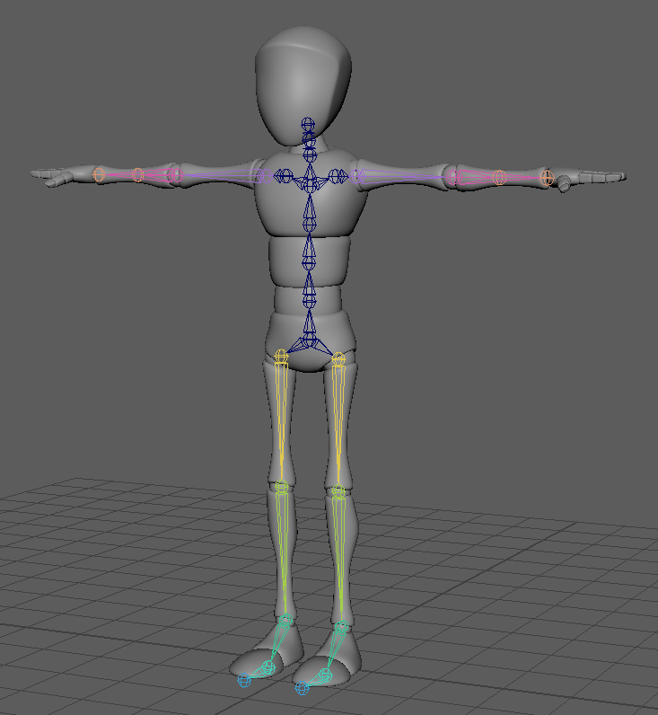
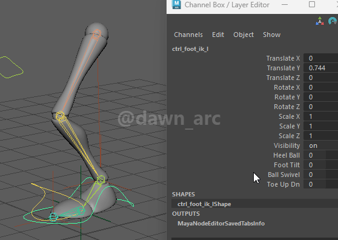

# Introduction

## UE5_Rig

Rig asset for UE5 Skeleton Mesh (Quinn) asset that mentioned in tutorial: [Maya Rigging](https://dawnarc.com/2020/04/mayarigging-notes/).  
  
Version: Maya 2025.3

## UE5_RIG_Leg_IK_Upgraded

Rig asset for advanced leg IK rigging. For more details, see: [[Maya]Rigging 16 - Ankles & Heels](https://dawnarc.com/2025/03/mayarigging-16-ankles-heels/).  
  
Version: Maya 2025.3

## Bony_Skinned

A simple skinned body mechanics rig asset, for rapid rig prototyping.  
  
Version: Maya 2025.3

## Leg_Rig

A simple leg Rigging example. Included features:
+ Heel and Ball joint IK;
+ Foot Tilt In and Tilt Out;
+ Ball Swivel;
+ Toe Up and Down;

For more details, see: [Leg Rigging Sample](https://dawnarc.com/2025/03/mayarigging-16-ankles-heels//#leg-rigging-sample)

 
Version: Maya 2025.3