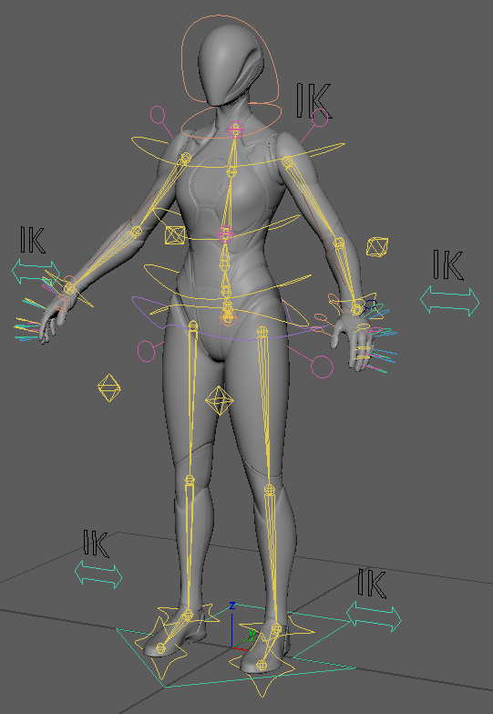

# Introduction

## UE5_Rig

Rig asset for UE5 Skeleton Mesh (Quinn) asset that mentioned in tutorial: [Maya Rigging](https://dawnarc.com/2020/04/mayarigging-notes/).  
  
Version: Maya 2025.3

## Bony_Skinned

A simple skinned body mechanics rig asset, for rapid rig prototyping.  
  
Version: Maya 2025.3
